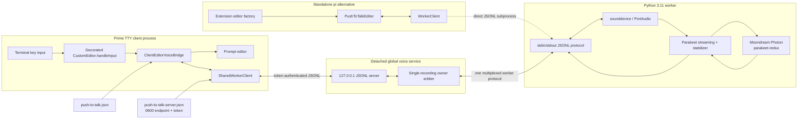
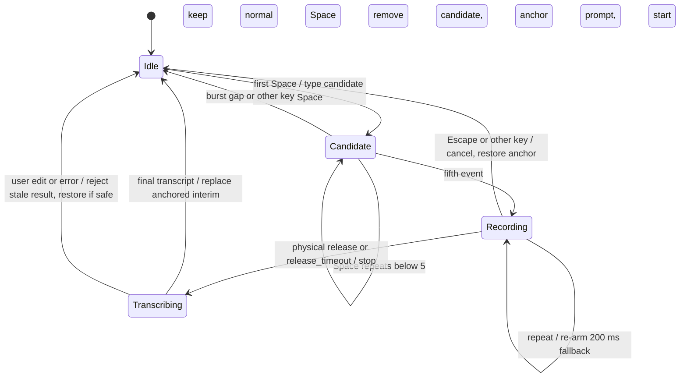
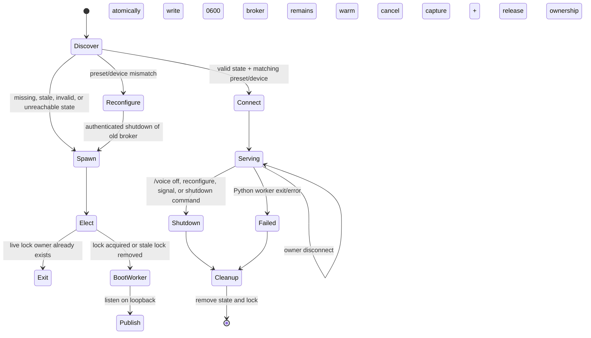

# Architecture

## Purpose and boundaries

`push-to-talk-prime` adds local speech-to-text to the Prime Agent and compatible pi editors. A hold gesture starts microphone capture, raw interim text replaces an in-editor meter, the locally stable prefix remains normal while the speculative suffix is dimmed, and the final transcript is inserted at the cursor that began the capture. Audio and transcript data stay local. The only normal network use is the initial model download.

The implementation has two integration paths:

- **Daemon-backed Prime:** the TTY client decorates `CustomEditor.prototype` and connects to one detached, authenticated loopback speech service shared by Prime clients.
- **Standalone/in-process pi:** the extension installs `PushToTalkEditor` through the public editor factory and owns a `WorkerClient` plus Python subprocess directly.

## Runtime topology



The broker and direct-worker paths are alternatives. They do not share a worker. Prime uses the broker to avoid loading one large model per terminal client; standalone pi uses the direct subprocess path.

## Prime client integration

Daemon-backed Prime loads extension modules in the TTY client before it constructs the editor, while the extension factory itself runs in the worker process. The public daemon UI bridge cannot carry editor callbacks. `installDaemonClientEditorBridge()` therefore decorates `CustomEditor.prototype.handleInput` in the TTY process and sets `wantsKeyRelease = true`.

Decoration is deliberately narrow:

- It runs only for a TTY Prime runtime, and not with `--in-process`.
- A `Symbol.for("push-to-talk-prime.editor-bridge")` global guard makes installation idempotent.
- It retains the original `handleInput` and forwards all input that the voice bridge does not consume.
- The bridge closes on process exit.
- A new client process is required after package updates because `/reload` cannot replace decoration already installed in the client.

The same module still registers `/voice` and session hooks in the extension worker. The client bridge watches the settings file so command-side changes propagate across the process boundary.

## Hold-Space and prompt transaction

A normal Space must remain immediate. The bridge passes the first candidate Space to the editor, counts repeat events, and commits at five events within the burst window. On commit it removes the leaked candidate, records the prompt prefix/suffix at the cursor, inserts a level marker, and starts capture. Kitty key-release stops capture immediately. Each repeat also arms the worker's 200 ms release-gap fallback.



The anchor is an optimistic editor transaction: `{original, expected, prefix, suffix}`. Marker, interim, and final replacement occurs only while current editor text equals `expected`. A capture generation rejects late replies. Thus typing during finalization cannot overwrite newer prompt edits. Final text gets boundary spaces where needed. Hold mode submits only when `autoSubmit` is enabled and the result has at least three words.

Standalone pi implements the same anchor and repeat semantics in `PushToTalkEditor`. It also supports tap mode and a manual toggle fallback; the daemon client bridge currently intercepts hold mode.

## Global service lifecycle

`SharedWorkerClient` reads `~/.prime/agent/push-to-talk-server.json` (or the pi agent directory when appropriate). The file contains a version, broker PID, loopback port, random 256-bit token, root, preset, and resolved device. It is written atomically with mode `0600`. The server listens only on `127.0.0.1` and rejects any socket whose first message is not the matching auth token.



Startup contenders are serialized by `push-to-talk-server.json.lock`, created exclusively. A contender exits if the recorded PID is alive; otherwise it removes stale lock/state and retries ownership. Clients retry discovery/start for up to 30 seconds. Configuration is process-wide: a preset or device mismatch shuts down the old authenticated broker before a replacement starts.

The broker owns exactly one Python worker and permits one recording owner at a time. A second client receives `microphone is in use by another Prime client`. Only the owner may stop, cancel, or arm/disarm release. Owner disconnect cancels capture and broadcasts `owner_released`; it does not stop the service. The Python worker watches the broker PID and exits if its parent disappears.

## Capture and transcription protocol

All IPC is newline-delimited JSON with request IDs. Async events (`ready`, `model_ready`, `level`, `interim`, `release_timeout`, `model_error`, `worker_exit`) have no client request ID. Each `interim` carries the cumulative raw `text` and a `stable_text` prefix from the same model update. The broker remaps client IDs to worker IDs and routes recording events only to the current owner.

```mermaid
sequenceDiagram
    participant E as Editor bridge
    participant C as SharedWorkerClient
    participant B as Loopback broker
    participant W as Python worker
    participant P as Parakeet stream

    E->>C: start
    C->>C: ensure broker connected; await model_ready
    C->>B: {id, command:start}
    B->>B: claim owner
    B->>W: {workerId, command:start}
    W->>P: transcribe(async audio chunks, stream=true)
    W-->>B: recording
    B-->>C: recording
    loop while held
        W-->>B: level
        B-->>C: level
        P-->>W: cumulative provisional snapshot
        W->>W: stabilize across snapshots
        W-->>B: raw text + stable prefix
        B-->>C: raw text + stable prefix
        C-->>E: render stable prefix + dim speculative suffix
    end
    E->>C: stop on release or timeout
    C->>B: {id, command:stop}
    B->>W: {workerId, command:stop}
    W->>W: stop microphone; append trailing silence
    W->>P: end stream and await final result
    P-->>W: final cumulative transcript
    W-->>B: transcript
    B->>B: release owner
    B-->>C: transcript
    C-->>E: generation-checked anchored replacement
```

### Python worker

`ptt_worker.py` starts model loading on a background executor, then announces protocol readiness before model readiness. `sounddevice.InputStream` captures mono float32 audio at the input device's default rate. Frames feed both a retained recording and a queue consumed by Parakeet's async streaming API. RMS level events are limited to about 20 Hz.

On stop, the recorder closes PortAudio, appends configurable trailing silence (320 ms by default) to improve final words and punctuation, ends the queue, and finalizes on a separate thread so the protocol loop stays responsive. Recordings shorter than 120 ms produce an empty transcript. Cancel invalidates the active session, closes audio, and drains the streaming future without emitting stale interim text.

The worker accepts `start`, `stop`, `cancel`, `devices`, `arm_release`, `disarm_release`, and `shutdown`. It enforces one active/finalizing session, reports structured errors, and bounds finalization and cleanup waits. Model load failures are broadcast as `model_error`.

### Parakeet streaming and stabilization

The worker loads `moondream/parakeet-redux` through Photon and requires Kestrel `0.8.0`, whose internal live windows it configures before model construction. Parakeet yields cumulative provisional hypotheses. `InterimTranscriptStabilizer` computes the common prefix across the last `PTT_INTERIM_STABILITY` snapshots (default two), then exposes text only through a word or punctuation boundary. It never re-emits unchanged visible text. The final `stream.result()` remains authoritative.

Telemetry is replaced with a no-op reporter unless `PTT_ALLOW_TELEMETRY=1` is explicitly set.

## Presets and devices

| Preset | Chunk | Right context | Left context | Intent |
|---|---:|---:|---:|---|
| `fast` | 160 ms | 160 ms | 2,000 ms | Lowest latency; less stable previews |
| `balanced` | 160 ms | 480 ms | 4,000 ms | Default latency/stability trade-off |
| `realtime` | 80 ms | 560 ms | 1,000 ms | Highest update cadence; more compute |
| `smooth` | 320 ms | 320 ms | 5,000 ms | Fewer, larger stable updates |

`PTT_STREAM_CHUNK_MS`, `PTT_STREAM_RIGHT_MS`, and `PTT_STREAM_LEFT_MS` can override preset values. Named settings are preferred because they are persisted and participate in broker configuration matching.

Devices are `auto`, `cpu`, `mps`, and `cuda`; the convenience value `gpu` resolves to `mps` on macOS and `cuda` elsewhere. `PTT_INPUT_DEVICE` independently selects a microphone by PortAudio index or name. Capture prefers the model-native 16 kHz rate to avoid repeated streaming resampling, then automatically retries at the device-native rate if probing or stream startup fails. Set `PTT_CAPTURE_SAMPLE_RATE=native` to opt out. The worker's `devices` command and `npm run doctor` enumerate valid inputs and report the selected capture rate.

Settings persist atomically in `~/.prime/agent/push-to-talk.json` with mode `0600`. Changing preset or inference device cancels active capture and restarts the applicable worker/service. Environment variables supply initial values and advanced overrides.

## Failure recovery and ownership rules

- **Editor safety:** prompt equality plus capture generations prevent stale or failed transcription from corrupting user input.
- **Microphone safety:** the broker grants exclusive ownership; disconnect, cancel, shutdown, or failure closes capture and releases the owner.
- **Process recovery:** stale endpoint/lock files are replaced; disconnected clients clear pending calls and can discover a new broker on their next worker instance.
- **Timeouts:** startup/request timeouts reject callers; stop/model warm-up allow longer model-bound windows. Release fallback prevents an indefinitely open hold when key-release events are absent.
- **Service failure:** Python exit notifies all clients, removes endpoint metadata, and terminates the broker. Model errors fail warm-up/capture instead of accepting new work silently.
- **Configuration ownership:** preset and compute device belong to the singleton broker, not an individual recording. Reconfiguration intentionally replaces the global service.
- **Shutdown ownership:** closing a Prime client closes only its socket. Disabling voice or changing broker configuration sends a global shutdown; normal client disconnect does not.

## Source map

| File | Responsibility |
|---|---|
| `extensions/push-to-talk.ts` | Settings, Prime prototype bridge, standalone editor/controller, IPC clients, anchor transaction |
| `scripts/voice-server.mjs` | Authenticated loopback singleton, lock/state files, ownership arbitration, worker multiplexing |
| `ptt_worker.py` | PortAudio capture, model lifecycle, streaming ASR, interim stabilization, finalization |
| `scripts/setup.mjs`, `scripts/doctor.mjs` | Locked environment setup and platform/device diagnostics |
| `tests-ts/` and `tests/` | Editor safety, singleton ownership/lifecycle, and worker/stabilizer behavior |
