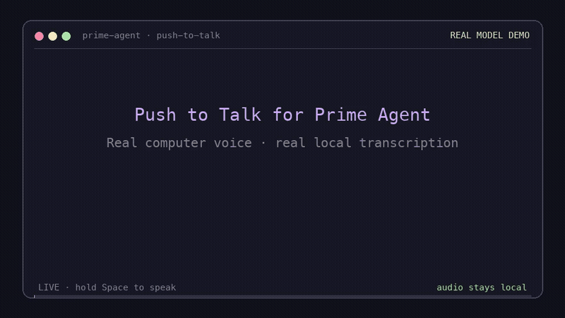

# Push to Talk for Prime Agent and pi

[](https://github.com/moreWax/push-to-talk-prime/actions/workflows/ci.yml)
[](LICENSE)



[Watch the MP4 demo with audio](assets/demo.mp4) · [How it works](ARCHITECTURE.md)

Claude Code-style local voice dictation for the Prime/pi chat editor. Hold **Space**, speak, and release. The transcript is inserted at the activation cursor without submitting unless auto-submit is enabled.

Transcription uses [moondream/parakeet-redux](https://huggingface.co/moondream/parakeet-redux) through Moondream Photon. Audio and text stay on your machine.

## Features

- Works as an installed extension in normal daemon-backed Prime Agent. No wrapper or Prime patch is required.
- Claude-style Space repeat detection with Kitty key-release support and a worker-side release fallback.
- Normal Space typing stays immediate; one candidate Space is removed when a hold commits.
- Minimal `▁▂▃▄▅▆▇█` recording indicator with no processing text left in the prompt.
- Native stateful Parakeet streaming with smooth 320 ms transcript updates.
- Stable live words replace the meter as speech is recognized; unstable partial words stay hidden.
- Transcript insertion at the activation cursor without automatic submission by default.
- One `/voice` command toggles the warm worker on or off.
- `/voice status` reports enabled state, preset, worker state, and device.
- `/voice preset fast|balanced|smooth` selects latency versus provisional stability without numeric tuning.
- One authenticated warm model service shared across all Prime sessions and clients.
- Local CPU, Apple Metal, or CUDA inference.

No terminal plugin, global keyboard hook, clipboard automation, launcher wrapper, Prime source patch, or cloud API is required.

## Prime Agent and pi compatibility

In daemon-backed Prime Agent, the package uses its client-loaded module to transform the terminal callback before input reaches the editor. The worker-side extension continues to own slash commands and supported UI requests. Standalone pi uses the normal custom-editor API.

The client worker remains warm while voice is enabled, so the first recording does not pay model startup cost. Toggle it off when not needed, and toggle it on to prewarm again:

```text
/voice
```

Inspect it without changing state:

```text
/voice status
```

Choose streaming behavior with a named preset:

```text
/voice preset fast
/voice preset balanced
/voice preset realtime
/voice preset smooth
```

- `fast`: 160 ms chunk + 160 ms lookahead; lowest first-token latency, less stable previews
- `balanced`: 160 ms chunk + 480 ms lookahead; recommended stable 160 ms cadence
- `realtime`: 80 ms chunk + 560 ms lookahead + 1 s left context; smoothest 80 ms cadence, higher compute
- `smooth`: 320 ms chunk + 320 ms lookahead; fewer, larger stable updates

Choose inference hardware:

```text
/voice device
/voice device auto
/voice device cpu
/voice device gpu
```

`gpu` maps to Apple Metal/MPS on macOS and CUDA on Linux/Windows. Explicit `mps` and `cuda` names are also accepted.

## Requirements

- Prime Agent 0.9.5 or a compatible pi build
- Node.js 22.19 or newer for setup/doctor scripts
- [`uv`](https://docs.astral.sh/uv/getting-started/installation/)
- A microphone and OS microphone permission
- Several GiB of free disk for Python, Torch, native kernels, and the model cache

Locked native dependency targets:

| Platform | Support |
|---|---|
| macOS 14+ on Apple silicon | Supported |
| Linux x86_64 with a compatible glibc (2.34+ recommended) | Supported |
| Linux aarch64 with compatible manylinux wheels | Supported where the locked wheel set resolves |
| Windows x86_64 | Supported |
| Intel macOS | Not supported by the locked native stack |
| Windows ARM64 | Not supported by the locked native stack |

`npm run setup` installs the locked Python environment. It does **not** download model weights. The 178 MB model downloads from Hugging Face when voice first warms; start once while online before relying on offline use.

### Linux audio package

```bash
# Debian/Ubuntu
sudo apt install libportaudio2

# Fedora
sudo dnf install portaudio

# Arch
sudo pacman -S portaudio
```

macOS and Windows `sounddevice` wheels include PortAudio.

## Install

Install directly from GitHub:

```bash
prime-agent package install https://github.com/moreWax/push-to-talk-prime
```

Or clone and prepare it manually:

```bash
git clone https://github.com/moreWax/push-to-talk-prime.git
cd push-to-talk-prime
npm run setup
prime-agent package install "$PWD"
```

An npm release can also be installed with:

```bash
prime-agent package install npm:push-to-talk-prime@<version>
```

Start a **new Prime client process** after installation or update. `/reload` reloads worker resources but cannot replace client-side prototype decoration already loaded in the current process.

Compatible standalone pi distributions can load the same `pi` extension manifest.

### Updating and rollback

For a published unpinned package:

```bash
prime-agent package update push-to-talk-prime
cd /path/to/push-to-talk-prime
npm run setup
npm run doctor
```

Pin a git tag or npm version for reproducible installs. Roll back by installing the previous tag/version, rerunning locked setup, and restarting Prime. Do not regenerate `uv.lock` during routine updates.

## Use

Voice is enabled in hold mode by default for this package.

| Action | Result |
|---|---|
| Hold Space | Commit after five repeat events and record until physical release |
| Type another key while recording (daemon Prime) | Cancel dictation and keep the typed input |
| `/voice` | Toggle hold-Space voice input and its warm worker |
| `/voice status` | Show enabled state, preset, worker state, and selected device |
| `/voice preset` | Show current preset and available names |
| `/voice preset fast|balanced|smooth` | Change and persist streaming behavior |
| Escape while recording | Cancel and restore the anchored prompt |
| `npm run doctor` | Validate dependencies and list microphones |

### Hold semantics

A single Space remains immediate normal typing. Five repeat events commit a hold; the one candidate Space is removed and native streaming capture starts. Kitty key release stops immediately. A 200 ms worker timer is the fallback when release events are unavailable.

Parakeet uses native 320 ms stateful streaming windows with 320 ms lookahead. Smaller windows lowered the first-token gate but produced empty, unstable, or stalled previews. This configuration grew the transcript consistently on every tested snapshot. The UI reveals each stable snapshot suffix in two revision-aware stages about 150 ms apart, giving a smoother visual stream without exposing lower-quality 160 ms hypotheses.

By default, release inserts text and leaves it for review. Set `autoSubmit` to `true` in the settings file to submit hold transcripts of at least three words.

## Configuration

Voice settings persist in `~/.prime/agent/push-to-talk.json`:

```json
{
  "enabled": true,
  "mode": "hold",
  "autoSubmit": false,
  "preset": "balanced",
  "device": "auto"
}
```

Runtime environment variables:

| Variable | Default | Meaning |
|---|---:|---|
| `PTT_DEVICE` | `auto` | Initial device before settings exist: `auto`, `cpu`, `gpu`, `mps`, or `cuda` |
| `PTT_INPUT_DEVICE` | system default | Microphone index or name from `npm run doctor` |
| `PTT_MODE` | `hold` | Initial mode before a settings file exists |
| `PTT_ENABLED` | `1` | Set `0` to start disabled before settings exist |
| `PTT_AUTO_SUBMIT` | `0` | Initial hold auto-submit setting |
| `PTT_PRESET` | `balanced` | Initial `fast`, `balanced`, or `smooth` preset |
| `PTT_CONFIG` | `~/.prime/agent/push-to-talk.json` | Alternate settings path |
| `PTT_UV` | `uv` | Path to the `uv` executable |
| `PTT_STREAM_CHUNK_MS` | preset value | Advanced numeric override for the update window |
| `PTT_STREAM_RIGHT_MS` | preset value | Advanced numeric override for right context |
| `PTT_STREAM_LEFT_MS` | preset value | Advanced override for repeated encoder history |
| `PTT_ALLOW_TELEMETRY` | unset | Set `1` to opt into Kestrel Photon telemetry; disabled by default |
| `PTT_TRAILING_SILENCE_MS` | `320` | Synthetic endpoint context added on release for final words and punctuation |
| `PTT_INTERIM_STABILITY` | `2` | Consecutive snapshots required before provisional text is shown |

## Permissions and troubleshooting

- **macOS:** allow microphone access for the terminal in **System Settings → Privacy & Security → Microphone**.
- **Windows:** enable desktop-app microphone access in **Settings → Privacy & security → Microphone**.
- **Linux:** confirm PipeWire/PulseAudio exposes an input with `npm run doctor`.
- **tmux:** enable extended keys/CSI-u for immediate physical release; otherwise the worker uses its repeat-gap fallback.
- Hold-Space requires keyboard repeat. Enable repeat in the OS/terminal if hold detection does not commit.

```bash
npm run setup
npm run doctor          # dependencies + microphone
npm run doctor:model    # also load Photon/model (downloads weights if absent)
npm test
```

## Supported languages

English, German, French, Spanish, Italian, Portuguese, Russian, Ukrainian, Croatian, Slovenian, Latvian, Lithuanian, Estonian, Finnish, Swedish, Danish, Dutch, Polish, Czech, Slovak, Hungarian, Romanian, Bulgarian, Greek, and Maltese.


## Community and project documentation

- [Getting Started](GETTING_STARTED.md)
- [Architecture](ARCHITECTURE.md)
- [Troubleshooting](TROUBLESHOOTING.md)
- [Contributing](CONTRIBUTING.md)
- [Support](SUPPORT.md)
- [Security](SECURITY.md)
- [Code of Conduct](CODE_OF_CONDUCT.md)
- [Changelog](CHANGELOG.md)
- [Release process](docs/RELEASING.md)

## Privacy, telemetry, and licenses

Audio and transcripts are processed locally. Model download and dependency installation require network access unless already cached.

Kestrel Photon telemetry is disabled by this package unless `PTT_ALLOW_TELEMETRY=1` is explicitly set. When enabled, upstream Kestrel may send hostname, instance/report UUIDs, model/service names, request/error/token counts, timing windows, and active GPU details to Moondream. The worker environment allowlist does not forward `MOONDREAM_API_KEY`, model-provider credentials, audio, or transcript content.

The extension source is MIT licensed. The model is CC BY 4.0 and is attributed in `THIRD_PARTY_NOTICES.md`. Model weights and native engine wheels are downloaded at setup/runtime and are not bundled in this package.

The installed `kestrel-kernels` license states that use requires a separate written agreement with M87 Labs and restricts copying/distribution. This notice is retained so downstream users can evaluate the applicable engine terms.

## Compatibility and security notes

Prime daemon support uses a client-side decoration of Prime 0.9.5's `CustomEditor` prototype because the public daemon UI bridge cannot transport editor callbacks. This path is tested against Prime 0.9.5 but is version-sensitive. Future Prime releases require a compatibility test before support is claimed.

`PTT_DEBUG_LOG` records transition metadata only, uses mode `0600` when creating the file, and no longer records prompt text or raw key bytes. Do not enable it unless diagnosing a problem.

All daemon-backed Prime clients share one authenticated loopback model service. Closing a client releases its recording ownership but keeps the warm service available. Run `/voice` to disable voice globally and unload it.

